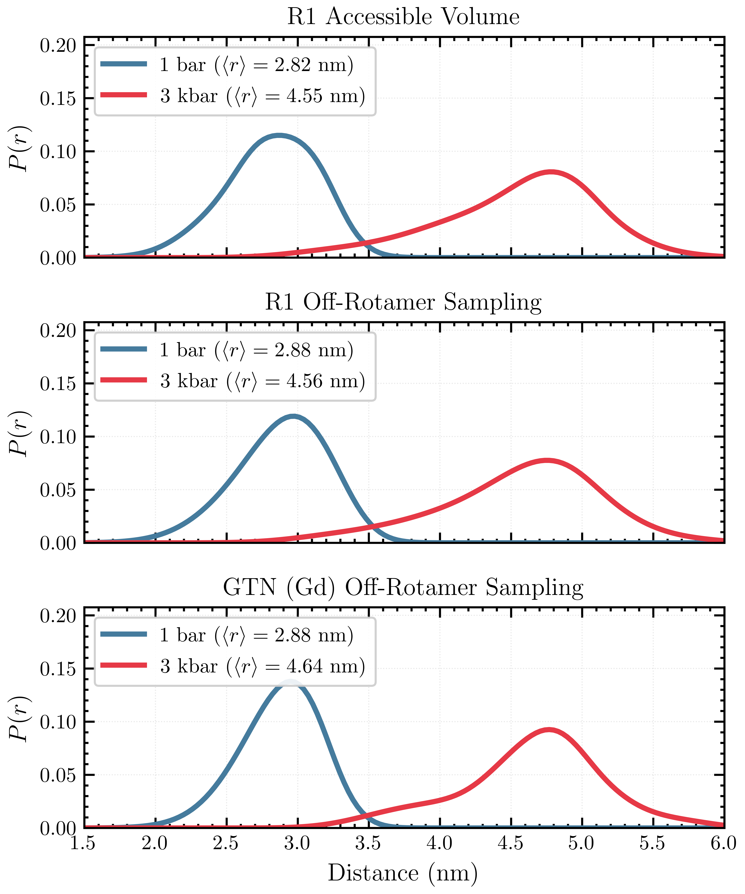
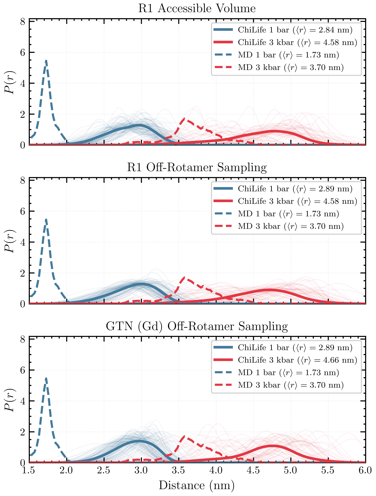
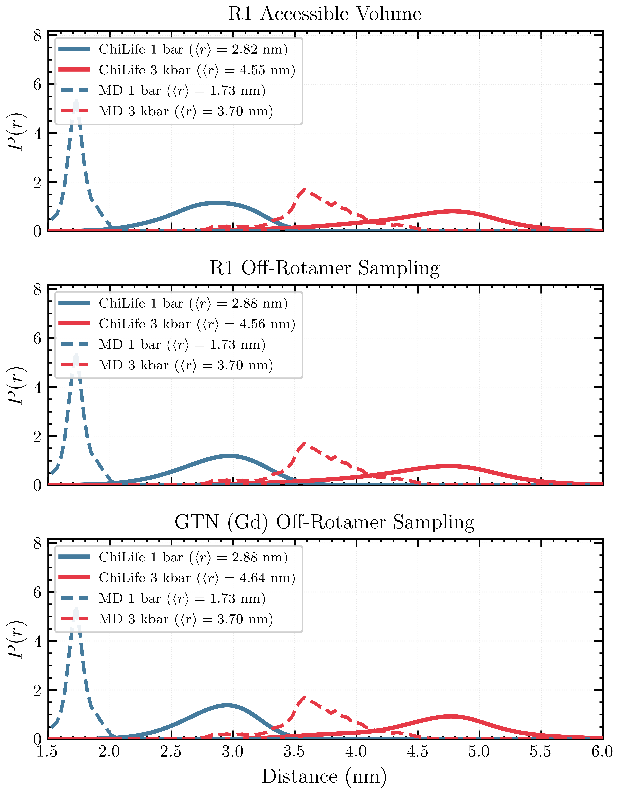
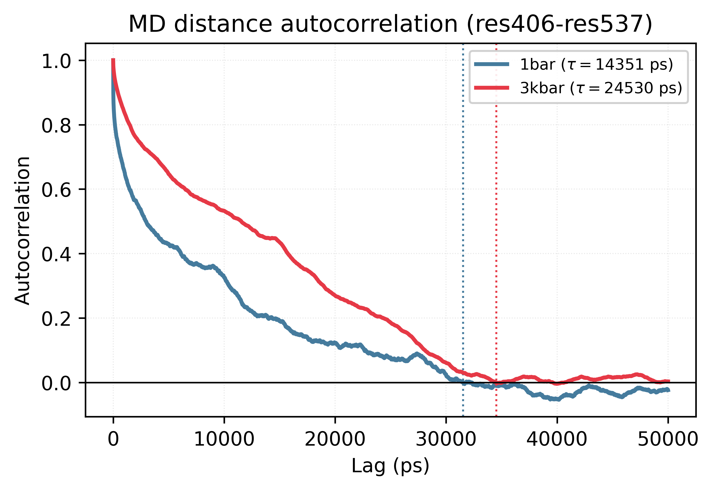
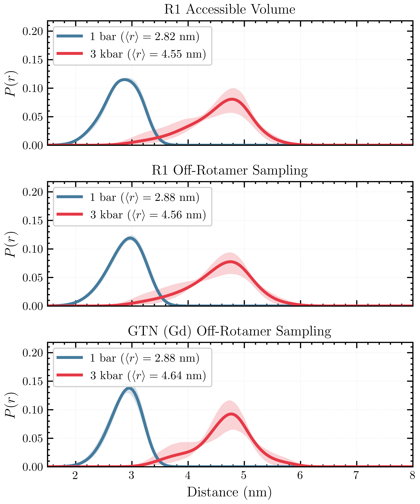
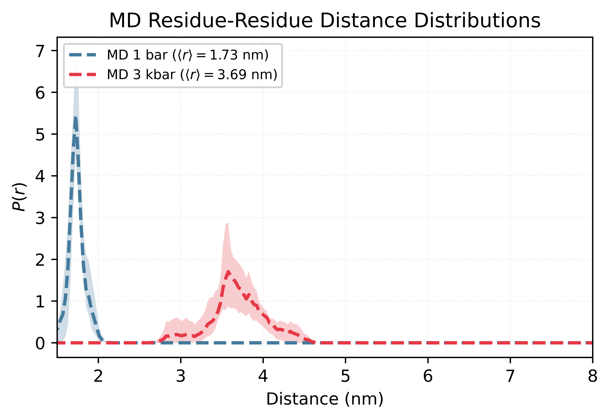

# chitraj

[](https://doi.org/10.5281/zenodo.21422883)

Tools for computing and comparing DEER distance distributions from MD trajectories using ChiLife.

## Installation
Create and activate the Conda environment, then install required plotting utilities:
```
conda env create -f environment_linux.yml -n chilife_env
conda activate chilife_env
pip install SciencePlots
```

## Overview
This workflow applies ChiLife to molecular dynamics (MD) trajectories to compute DEER distance distributions between specified residue pairs.

Two primary modes are supported:
- **Trajectory-based averaging** (frame-by-frame over MD)
- **Cluster-based averaging** (ensemble-weighted using RMSD clusters)

## Basic Usage
Compute and compare distance distributions between two residues under two conditions (e.g., 1 bar vs. 3 kbar), using Monte Carlo sampling of spin-label rotamers.

```
python compare_R1_rotlib_traj.py \
    --top1 top_1bar.pdb \
    --traj1 traj_1bar.xtc \
    --top2 top_3kbar.pdb \
    --traj2 traj_3kbar.xtc \
    --site1-cond1 406 \
    --site2-cond1 537 \
    --site1-cond2 4 \
    --site2-cond2 135 \
    --label-name GTN \
    --sample 5000 \
    --rotlib GTN_rotlib.npz \
    --start-frame 0 \
    --max-frames 30000 \
    --stride 10 \
    --outdir gtn_sample_5000 \
    --tag GTN_sample_5000
```

Notes:
- Residue indices may differ between systems (e.g., 406/537 vs. 4/135).
- `--sample` controls the number of Monte Carlo rotamer samples per frame.
- `--stride` can be increased to reduce computational cost.

Output:
- Per-frame distance summaries
- Ensemble-averaged distributions with 95% confidence intervals
- Results stored in the specified `--outdir`

## Trajectory-Based Calculation (Parallelized)
Large trajectories are processed by splitting into chunks and distributing across a SLURM job array.

1. Submit jobs

Edit `submit_array.sh`:
- `TOP1`, `TRAJ1`, `TOP2`, `TRAJ2`
- `SITE_COND1`, `SITE_COND2`
- `MODE` (label type and sampling settings)
- `CHUNK_SIZE` (as needed, 100 is reasonable)
- `#SBATCH --array` should cover all frames for the chosen `CHUNK_SIZE`
  - e.g., for 30001 frame trajectory with chunks of 100, the number of chunks needed is `ceil(30001 / 100) = 301`
  - array should be `0-299`: `#SBATCH --array=0-299`

Then run:

```
sbatch submit_array.sh
```

This creates:
- `logs/`
- `chunk_output`

2. Re-run failed chunks
If some jobs fail:

```
./submit_missing_chunks.sh
```

This script:
- Detects missing outputs in chunk_output/
- Resubmits only failed chunks via SLURM array

3. Combine chunk outputs
```
python combine_chilife_chunks.py \
    --chunk-dir stride_1/gtn_sample_5000/chunk_output \
    --prefix GTN_sample_5000 \
    --outdir stride_1/gtn_sample_5000/combined_output
```

4. Plot trajectory-averaged results
Edit `MODEL_FILES` in the script as needed:

```
python plot_R1_rotlib_traj.py
```

Result:



## Cluster-Based Calculation
This approach computes **ensemble-weighted** distributions using RMSD clustering results (e.g., from GROMACS).

Inputs:
- `clusters.pdb` (cluster representatives)
- `clust-size.xvg` (cluster populations)

Run:

```
python compare_R1_rotlib_clusters.py \
    --pdb1 clusters_1bar.pdb \
    --xvg1 clust-size_1bar.xvg \
    --pdb2 clusters_3kbar.pdb \
    --xvg2 clust-size_3kbar.xvg \
    --site1-cond1 406 \
    --site2-cond1 537 \
    --site1-cond2 4 \
    --site2-cond2 135 \
    --label-name GTN \
    --sample 5000 \
    --rotlib GTN_rotlib.npz \
    --outdir cluster_output \
    --prefix GTN_sample_5000
```

Plot cluster-weighted results:

```
python plot_cluster_label_comparison.py
```

Result:


## Comparison with MD
These scripts overlay ChiLife-derived distributions with MD-based distance distributions (e.g., from GROMACS).

**Cluster-weighted vs MD:**

```
python plot_cluster_label_md_comparison.py
```

Result:


**Trajectory-averaged vs MD:**

```
python plot_traj_label_md_comparison.py
```

Result:


## Block-Bootstrap for Confidence Interval Estimation
Molecular dynamics trajectories produce highly correlated conformations. The number of independent
samples is estimated using block-bootstrap resampling, with a window size determined by the
autocorrelation time for the residue-residue distance of interest. Given MD distance data, calculate the autocorrelation time using:

```
python estimate_autocorrelation_time.py
```
Results:


| Condition | τ (frames) | τ (ns) | ACF zero-crossing (frames) | Effective independent samples (of 30,001 frames) |
| --------- | ---------- | ------ |--------------------------- | ------------------------------------------------ |
| 1 bar     | 1435       | 14.4   | 3153                       | 21                                               |
| 3 kbar    | 2453       | 24.5   | 3452                       | 12                                               |

Here, we set the block size to twice the more conservative maximum over both conditions (in this case 3 kbar):
4900 frames.

Generate confidence intervals using `combine_chilife_chunks.py`:
```
python combine_chilife_chunks.py \
    --chunk-dir stride_1/gtn_sample_5000/chunk_output \
    --prefix GTN_sample_5000 \
    --outdir stride_1/gtn_sample_5000/combined_output \
    --n-boot 2000 \
    --block-size 4900
```
ChiLife Distribution Results:



A similar procedure is applied to the MD-derived distance distributions:

```
python make_md_distribution.py --block-size 4900 --n-boot 2000
python plot_md_distribution.py
```

MD Distribution Results:


## Workflow Summary
1. Run ChiLife on trajectory (chunked SLURM jobs)
2. Combine outputs (block bootstrap for CI estimation)
3. (Optional) Perform clustering and compute weighted distributions
4. Compare against MD-derived distributions
5. Visualize results